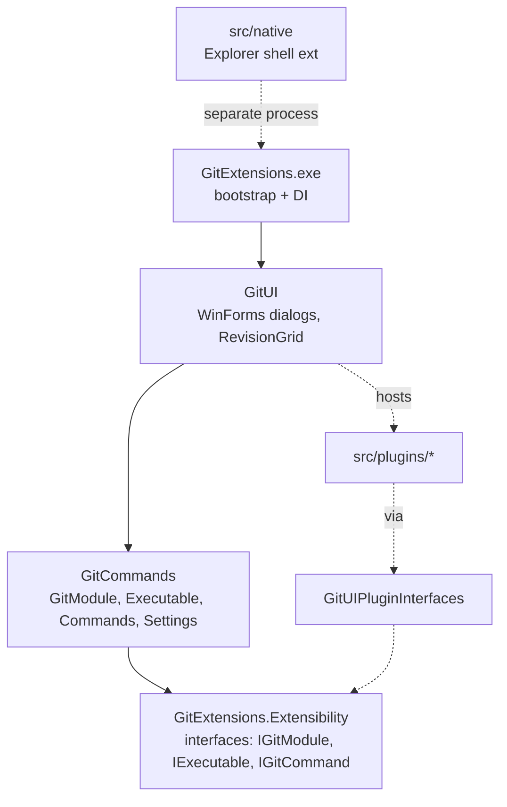

<!-- L1 CONCEPTUAL. Agentic doc: TL;DR at top, Why→What→How, code pointers not code, ~100 lines. -->
# Architecture Overview (L1)

**TL;DR:** Git Extensions is a WinForms desktop app that drives the real `git` executable.
It is layered into four tiers with a strict one-way dependency direction:
`Extensibility → GitCommands → GitUI → GitExtensions(exe)`. Plugins and native code hang off
the sides. Read this to understand *how the pieces fit*; then jump to an
[L2 subsystem](../L2-core-platform/docs-index.md) or [L3 flow](../L3-flows/docs-index.md).

**Related:** [L0 primer](../L0-foundations/gitextensions-primer.md) · [project-map](project-map.md) · [git-command-execution](../L2-core-platform/docs-index.md) · [structured-commands](../L2-core-platform/docs-index.md)

## Why (the shape of the app)

Git Extensions does not reimplement git — it **builds git command lines, runs the git process,
and parses the output** into models the UI can show. So the architecture separates three
concerns: *how to talk to git* (execution), *what to ask git* (structured commands + models),
and *how to show it* (WinForms UI). Keeping these in separate assemblies enforces the
dependency direction and keeps the plugin surface (`Extensibility`) small and stable.

## What (the four tiers)

- **`GitExtensions.Extensibility`** — the contract layer. Interfaces and primitives everyone
  depends on: `IGitModule`, `IExecutable`/`IProcess`, `IGitCommand`, `ArgumentBuilder`,
  `IGitUICommands`, settings abstractions. **Versioned** — changes here affect the public
  plugin interface (call it out in commit messages).
- **`GitCommands`** — the engine. `GitModule` (one instance per repository) runs git via
  `Executable`, `Commands` builds structured argument sets, and output parsers produce models.
  Also owns settings/config, remotes, and submodule logic. No WinForms dependency.
- **`GitUI`** — the presentation tier. `FormBrowse` is the main window; dialogs under
  `CommandsDialogs/` implement each user operation; `RevisionGrid` renders history.
  `GitUICommands` is the bridge that runs commands *with* UI feedback and fires repo-changed events.
- **`GitExtensions` (exe)** — thin bootstrap: sets up DI (`ServiceContainerRegistry`), global
  exception handling, DPI/theming, then launches the UI.

### Side dependencies

- **Plugins** (`src/plugins/*`) implement `GitUIPluginInterfaces` and are hosted by `GitUI`.
- **Native** (`src/native/GitExtensionsShellEx`) is a separate C++ Explorer shell extension.
- **`ResourceManager`** provides translations; **`GitExtUtils`** provides shared utilities.

## How (find it in code)

- Entry point: `Program.Main` in [Program.cs](../../../src/app/GitExtensions/Program.cs).
- DI registration: `ServiceContainerRegistry` (present in `GitExtensions`, `GitCommands`, and `GitUI`).
- Repo engine: `GitModule` in [GitModule.cs](../../../src/app/GitCommands/Git/GitModule.cs).
- UI bridge: `GitUICommands` in [GitUICommands.cs](../../../src/app/GitUI/GitUICommands.cs).
- Contracts: browse [GitExtensions.Extensibility/](../../../src/app/GitExtensions.Extensibility/).

## Hard rules

- **NEVER** add a dependency that reverses the arrow direction (e.g. `GitCommands` must not
  reference `GitUI`).
- **ALWAYS** run git through `IGitModule` / `Executable`; never spawn `git` ad-hoc.
- Treat `GitExtensions.Extensibility` as a **public API** — additive, deliberate changes only.

**Next:** [project-map](project-map.md) for the per-project breakdown, or the
[git-command-execution](../L2-core-platform/docs-index.md) doc for the execution pipeline.
