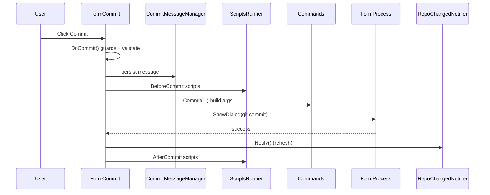

<!-- L3 FLOW. Agentic doc: TL;DR at top, Why→What→How, code pointers not code, ~100 lines.
     This is the template for other flow docs: trace UI → command → git → refresh. -->
# Commit Flow (L3)

**TL;DR:** The commit UI is `FormCommit`. It shows working-tree changes, lets the user stage
files and write a message, then builds a `git commit` argument set with `Commands.Commit(...)`
and runs it through `FormProcess.ShowDialog`. Before/after commit it runs user scripts and, on
success, notifies the app to refresh via `RepoChangedNotifier`.

**Related:** [structured-commands](../L2-core-platform/structured-commands.md) · [git-command-execution](../L2-core-platform/git-command-execution.md) · [L0 primer](../L0-foundations/gitextensions-primer.md)

**Key files:** [FormCommit.cs](../../../src/app/GitUI/CommandsDialogs/FormCommit.cs) ·
[Commands.Arguments.cs](../../../src/app/GitCommands/Git/Commands.Arguments.cs) (`Commit`) ·
[CommitMessageManager.cs](../../../src/app/GitCommands/CommitMessageManager.cs) ·
[FormProcess.cs](../../../src/app/GitUI/HelperDialogs/FormProcess.cs)

## Why

Committing is more than `git commit`: Git Extensions must validate state (merge conflicts,
detached HEAD, empty message), persist and template the commit message, honor amend/sign-off/
GPG options, run pre/post commit **user scripts**, and refresh every open view afterward. All of
that orchestration lives in `FormCommit`, keeping the raw git call thin.

## What (the actors)

- **`FormCommit`** — the dialog. Hosts the *Unstaged* and *Staged* file lists, the message box,
  and commit options (amend, sign-off, GPG, `--no-verify`, reset author).
- **`CommitMessageManager`** — loads/saves the in-progress commit message and template
  (`Module.WorkingDirGitDir`, `CommitEncoding`).
- **`Commands.Commit(...)`** — builds the `git commit` `ArgumentString` from the chosen options.
- **`FormProcess`** — the process dialog that runs the git command and shows its output.
- **`ScriptsRunner` + `ScriptEvent.BeforeCommit`/`AfterCommit`** — user-defined hooks.

## How (the sequence)

Entry: user clicks *Commit* → `CheckForStagedAndCommit(bool push)`
([FormCommit.cs](../../../src/app/GitUI/CommandsDialogs/FormCommit.cs) ~L1070) → inner `DoCommit()` (~L1172):

1. **Guard checks:** abort if `Module.InTheMiddleOfConflictedMerge()`; require a non-empty,
   valid message (`IsCommitMessageValid()`); if `Module.IsDetachedHead()` and not rebasing,
   prompt to checkout/create a branch or continue.
2. **Persist message:** save `AppSettings.LastCommitMessage` and write the message to file via
   `_commitMessageManager.WriteCommitMessageToFileAsync(...)`.
3. **Pre-commit scripts:** `ScriptsRunner.RunEventScripts(ScriptEvent.BeforeCommit, this)`;
   abort if it returns false.
4. **Build the command:** `Commands.Commit(amend, signOff, author, useExplicitCommitMessage,
   commitMessageFile, Module.GetPathForGitExecution, noVerify, gpgSign, gpgKeyId, allowEmpty,
   resetAuthor)` → an `ArgumentString`.
5. **Run git:** `FormProcess.ShowDialog(this, UICommands, arguments: commitCmd, Module.WorkingDir,
   input: null, useDialogSettings: true)` → runs `git commit` and returns success.
6. **Notify + post scripts:** `UICommands.RepoChangedNotifier.Notify()` refreshes open views;
   on success run `ScriptEvent.AfterCommit`. If *Commit & Push* was chosen, the push flow follows.

## Notes & gotchas

- Staging/unstaging happens in the file lists before `DoCommit`; `Staged.IsEmpty` maps to the
  `allowEmpty` argument.
- Commit uses the **argument-only** command pattern (`ArgumentString` + `FormProcess`), not the
  `IGitCommand` + `StartCommandLineProcessDialog` path — see [structured-commands](../L2-core-platform/structured-commands.md).
- Amend, GPG sign, sign-off, and `--no-verify` are all driven by toolbar/menu toggles in `FormCommit`.

## Hard rules

- **NEVER** bypass the guard checks — merge-conflict and detached-HEAD handling prevent data loss.
- Any new commit option MUST be threaded through `Commands.Commit(...)`, not appended as a raw string.
- After a state change, **ALWAYS** call `RepoChangedNotifier.Notify()` so views refresh.
- If you add UI strings here, update `English.xlf` via `update-loc.cmd`.
